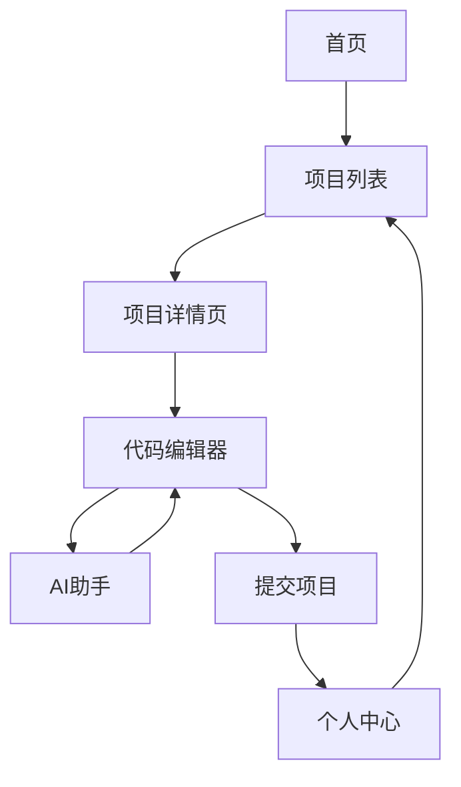

## 1. Product Overview
Python数据分析技术AI训练网站是一个专为大学生设计的交互式学习平台，通过实践项目和AI辅助，帮助学生掌握数据分析核心技能。
- 提供真实数据集和实际业务场景，让学生在实践中学习Python数据分析技术
- 目标用户为计算机、统计学、商科等专业的大学生，市场价值在于提升学生的就业竞争力和实际应用能力

## 2. Core Features

### 2.1 User Roles
| Role | Registration Method | Core Permissions |
|------|---------------------|------------------|
| 学生用户 | 邮箱注册 | 浏览课程、完成训练项目、查看学习进度、获取AI辅助 |

### 2.2 Feature Module
1. **首页**：英雄区、导航栏、训练项目列表、学习路径
2. **项目详情页**：项目描述、任务要求、代码编辑器、AI助手
3. **个人中心**：学习进度、完成项目、技能评估

### 2.3 Page Details
| Page Name | Module Name | Feature description |
|-----------|-------------|---------------------|
| 首页 | 英雄区 | 展示平台价值主张，吸引用户注册 |
| 首页 | 训练项目列表 | 展示10个数据分析训练项目，包含难度级别和简介 |
| 首页 | 学习路径 | 展示从基础到高级的学习路线图 |
| 项目详情页 | 项目描述 | 详细介绍项目背景、目标和学习要点 |
| 项目详情页 | 任务要求 | 明确列出项目的具体任务和评估标准 |
| 项目详情页 | 代码编辑器 | 内置Python代码编辑器，支持实时运行和调试 |
| 项目详情页 | AI助手 | 提供代码建议、错误修复和学习指导 |
| 个人中心 | 学习进度 | 展示已完成项目和学习时间统计 |
| 个人中心 | 技能评估 | 基于完成项目的技能掌握程度评估 |

## 3. Core Process
用户注册登录后，从首页浏览训练项目，选择感兴趣的项目进入详情页，在代码编辑器中完成任务，获得AI助手的实时指导，完成后提交项目并查看反馈。

## 4. User Interface Design
### 4.1 Design Style
- 主色调：蓝色(#1E40AF)和绿色(#10B981)，代表科技感和成长
- 按钮风格：圆角按钮，带有轻微的阴影效果
- 字体：使用Inter作为主要字体，代码部分使用等宽字体
- 布局风格：卡片式布局，清晰的层次结构
- 图标风格：使用简约的线性图标，搭配适当的emoji增强视觉效果

### 4.2 Page Design Overview
| Page Name | Module Name | UI Elements |
|-----------|-------------|-------------|
| 首页 | 英雄区 | 大型渐变背景，突出平台名称和价值主张，包含注册按钮 |
| 首页 | 训练项目列表 | 卡片式布局，每个项目卡片包含标题、难度、简介和开始按钮 |
| 项目详情页 | 项目描述 | 清晰的标题层级，项目背景和目标的详细说明 |
| 项目详情页 | 代码编辑器 | 深色主题，代码高亮，运行按钮和输出区域 |
| 项目详情页 | AI助手 | 侧边栏形式，提供实时建议和帮助 |
| 个人中心 | 学习进度 | 进度条和图表展示学习情况，完成项目的时间线 |

### 4.3 Responsiveness
采用桌面优先设计，同时支持平板和移动设备的自适应布局。在小屏幕设备上，代码编辑器会调整为全屏模式，AI助手改为底部弹出式。

## 5. 训练项目列表
1. **数据清洗与预处理**：处理真实世界的脏数据，学习数据清洗技巧
2. **探索性数据分析**：分析销售数据，发现业务洞察
3. **数据可视化**：创建交互式数据图表，提升数据表达能力
4. **统计分析**：应用统计方法分析学生成绩数据
5. **机器学习入门**：使用分类算法预测客户流失
6. **时间序列分析**：分析股票价格数据，预测趋势
7. **自然语言处理**：情感分析社交媒体数据
8. **推荐系统**：基于用户行为构建电影推荐系统
9. **数据管道构建**：设计自动化数据处理流程
10. **大数据分析**：处理和分析大规模数据集