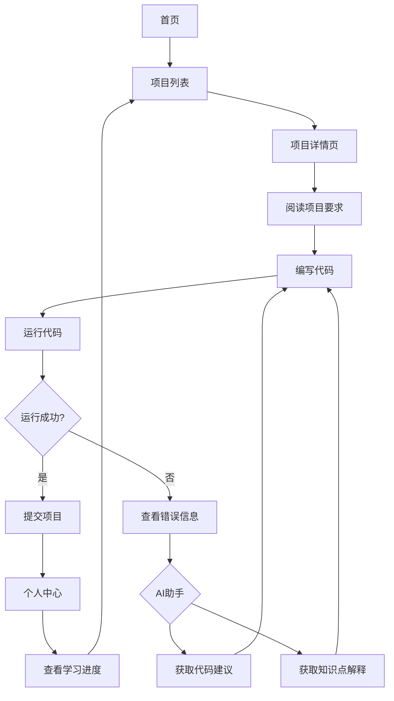

## 1. 产品概述
Python数据分析技术AI训练网站是一个专为大学生设计的交互式学习平台，通过实践项目和AI辅助，帮助学生掌握Python基础编程技能。本平台针对零基础或初学者，提供从Python语法入门到实战项目的完整学习路径。

- **目标用户**：计算机、统计学、商科等专业的大学生，特别是数据分析方向
- **核心价值**：通过10个精心设计的Python基础训练项目，让学生快速掌握编程技能
- **市场定位**：提升学生的编程基础能力，为后续数据分析学习奠定坚实基础

## 2. 核心功能

### 2.1 用户角色
| 角色 | 注册方式 | 核心权限 |
|------|----------|----------|
| 学生用户 | 邮箱注册 | 浏览课程、完成训练项目、查看学习进度、获取AI辅助 |

### 2.2 功能模块
1. **首页**：英雄区、导航栏、训练项目列表、学习路径、Python基础概念介绍
2. **项目详情页**：项目描述、任务要求、代码编辑器、AI助手、运行结果展示
3. **个人中心**：学习进度、完成项目、技能评估、学习时间统计
4. **登录注册**：用户认证系统、学习记录保存

### 2.3 页面详情
| 页面名称 | 模块名称 | 功能描述 |
|---------|---------|----------|
| 首页 | 英雄区 | 展示平台价值主张和学习Python的重要性，吸引用户注册 |
| 首页 | Python基础介绍 | 简要介绍Python特性和应用场景 |
| 首页 | 训练项目列表 | 展示10个Python基础训练项目，包含难度级别和简介 |
| 首页 | 学习路径 | 展示从基础语法到实战应用的学习路线图 |
| 项目详情页 | 项目描述 | 详细介绍项目背景、目标、学习要点和知识点 |
| 项目详情页 | 任务要求 | 明确列出项目的具体任务和分步指导 |
| 项目详情页 | 代码编辑器 | 内置Python代码编辑器，支持语法高亮和代码补全 |
| 项目详情页 | 运行结果 | 实时显示代码运行输出和错误信息 |
| 项目详情页 | AI助手 | 提供代码建议、错误修复、知识点解释和实时指导 |
| 个人中心 | 学习进度 | 展示已完成项目数量和学习时间统计 |
| 个人中心 | 技能评估 | 基于完成项目的技能掌握程度评估 |
| 个人中心 | 项目时间线 | 记录每个项目的完成时间和获得分数 |

## 3. 核心流程

```mermaid
flowchart TD
    A[首页] --> B[项目列表]
    B --> C[项目详情页]
    C --> D[阅读项目要求]
    D --> E[编写代码]
    E --> F[运行代码]
    F --> G{运行成功?}
    G -->|是| H[提交项目]
    G -->|否| I[查看错误信息]
    I --> J{AI助手}
    J --> K[获取代码建议]
    J --> L[获取知识点解释]
    K --> E
    L --> E
    H --> M[个人中心]
    M --> N[查看学习进度]
    N --> B
```

## 4. 用户界面设计

### 4.1 设计风格
- **主色调**：科技蓝(#0066FF)和活力橙(#FF6600)，代表创新和活力
- **辅助色**：深灰(#1A1A2E)用于代码编辑器背景，浅灰(#F5F7FA)用于页面背景
- **按钮风格**：圆角按钮，带有hover动画效果
- **字体**：使用思源黑体(Noto Sans SC)作为主要中文字体，JetBrains Mono用于代码
- **布局风格**：现代卡片式布局，清晰的视觉层次
- **图标风格**：使用线性图标和emoji结合，增强亲和力

### 4.2 页面设计概览
| 页面名称 | 模块名称 | UI元素 |
|---------|---------|--------|
| 首页 | 英雄区 | 大型渐变背景，突出"Python基础训练平台"，包含学习Python的价值 |
| 首页 | Python特性展示 | 3个核心特性卡片：简洁易学、应用广泛、就业前景好 |
| 首页 | 训练项目列表 | 卡片式布局，每个项目卡片包含标题、难度(初级)、简介和开始按钮 |
| 首页 | 学习路径 | 可视化步骤图，从"语法基础"到"实战应用" |
| 项目详情页 | 项目描述 | 清晰的项目标题，背景说明，知识点列表 |
| 项目详情页 | 任务分解 | 分步骤的任务卡片，每步有详细指导 |
| 项目详情页 | 代码编辑器 | 深色主题，语法高亮，行号显示 |
| 项目详情页 | AI助手 | 智能助手图标侧边栏，提供实时帮助 |
| 个人中心 | 学习仪表盘 | 环形进度图，统计数据卡片 |
| 个人中心 | 项目完成时间线 | 时间线形式展示项目完成历史 |

### 4.3 响应式设计
采用桌面优先设计，同时支持平板和移动设备的自适应布局。核心特性：
- 桌面端：侧边导航栏 + 主内容区布局
- 平板端：折叠导航 + 自适应网格
- 移动端：底部导航栏 + 全屏内容

## 5. Python基础训练项目列表

### 项目1：Python开发环境搭建
- **难度**：初级
- **描述**：学习安装Python和Jupyter Notebook，配置开发环境
- **任务**：
  1. 安装Python 3.x版本
  2. 安装PyCharm或VS Code编辑器
  3. 配置虚拟环境
  4. 编写第一个"Hello, World!"程序
- **知识点**：Python安装、环境变量、IDE使用、第一个程序

### 项目2：变量和数据类型
- **难度**：初级
- **描述**：学习Python中的基本数据类型和数据存储
- **任务**：
  1. 创建不同类型的变量(整数、浮点数、字符串、布尔值)
  2. 练习数据类型转换
  3. 使用print()函数输出数据
  4. 编写简单的计算器程序
- **知识点**：变量命名规则、整数、浮点数、字符串、布尔值、数据类型转换

### 项目3：运算符和表达式
- **难度**：初级
- **描述**：学习Python中的各种运算符
- **任务**：
  1. 算术运算符练习(加减乘除、幂运算、取余)
  2. 比较运算符练习
  3. 逻辑运算符练习(and、or、not)
  4. 赋值运算符练习
  5. 编写一个成绩评级程序
- **知识点**：算术运算符、比较运算符、逻辑运算符、赋值运算符、运算符优先级

### 项目4：条件语句
- **难度**：初级
- **描述**：学习使用if-elif-else进行条件判断
- **任务**：
  1. 简单的if语句练习
  2. if-else语句练习
  3. 多重条件的if-elif-else练习
  4. 嵌套条件语句
  5. 编写一个猜数字游戏
- **知识点**：if语句、else子句、elif子句、嵌套if、条件表达式

### 项目5：循环结构
- **难度**：初级
- **描述**：学习使用for和while循环
- **任务**：
  1. for循环遍历列表和字符串
  2. range()函数的使用
  3. while循环的基本使用
  4. 循环控制语句(break、continue)
  5. 嵌套循环练习
  6. 编写一个九九乘法表程序
- **知识点**：for循环、while循环、range()函数、break语句、continue语句、嵌套循环

### 项目6：列表和元组
- **难度**：初级
- **描述**：学习Python中的序列数据结构
- **任务**：
  1. 创建和访问列表
  2. 列表的增删改查操作
  3. 列表的切片操作
  4. 列表的排序和反转
  5. 元组的创建和使用
  6. 编写一个学生成绩管理系统
- **知识点**：列表创建、索引访问、切片操作、常用方法append/insert/remove、元组特点

### 项目7：字典和集合
- **难度**：初级
- **描述**：学习Python中的映射和集合类型
- **任务**：
  1. 创建和访问字典
  2. 字典的增删改查
  3. 字典的遍历方法
  4. 创建和使用集合
  5. 集合的交、并、差运算
  6. 编写一个通讯录管理系统
- **知识点**：字典创建、键值对访问、字典方法、集合特点、集合运算

### 项目8：函数和模块
- **难度**：初级
- **描述**：学习函数的定义和使用，以及模块的导入
- **任务**：
  1. 定义无参数和无返回值的函数
  2. 定义带参数和返回值的函数
  3. 默认参数和关键字参数
  4. 变量的作用域
  5. 导入和使用标准库模块(math、random)
  6. 编写一个计算器模块
- **知识点**：函数定义、参数传递、返回值、默认参数、*args、**kwargs、作用域、模块导入

### 项目9：字符串处理
- **难度**：初级
- **描述**：学习Python字符串的常用操作
- **任务**：
  1. 字符串的索引和切片
  2. 字符串的查找和替换
  3. 字符串的分割和连接
  4. 字符串的大小写转换
  5. 字符串的格式化
  6. 编写一个文本分析程序(词频统计)
- **知识点**：字符串索引、切片、常用方法format/f-string、strip/split/join、正则表达式基础

### 项目10：综合项目 - 学生信息管理系统
- **难度**：初级
- **描述**：综合运用所学知识，开发一个学生信息管理系统
- **任务**：
  1. 使用字典存储学生信息
  2. 实现学生信息的增删改查功能
  3. 实现学生成绩的统计功能
  4. 实现数据持久化(保存到文件)
  5. 编写程序使用说明
  6. 添加异常处理和输入验证
- **知识点**：综合应用、文件操作、异常处理、数据持久化、代码组织、程序设计思想

## 6. 技术要求
- 前端技术：React + TypeScript + Tailwind CSS
- 编辑器组件：Monaco Editor或CodeMirror
- 路由管理：React Router
- 状态管理：Zustand或Context API
- AI助手：集成OpenAI API或本地模拟
- 代码执行：前端沙箱环境或后端API
- 响应式设计：移动优先，支持各种屏幕尺寸
