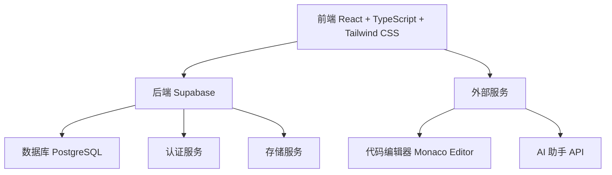
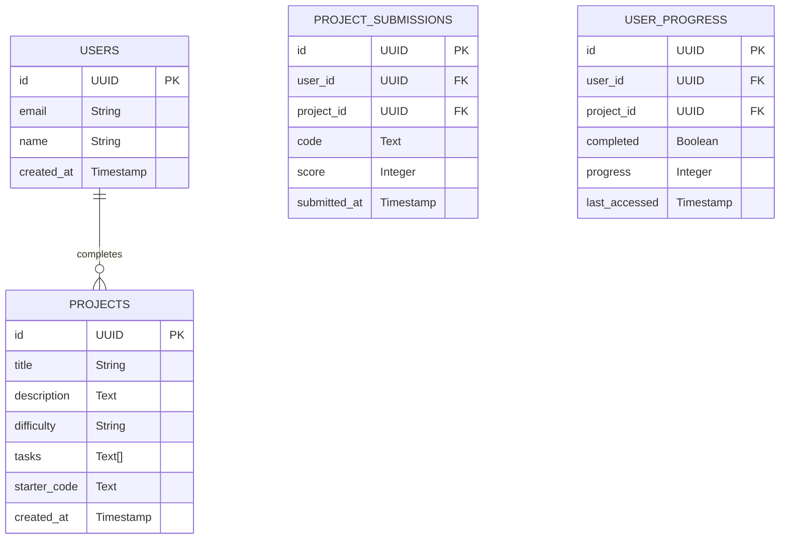

## 1. Architecture Design


## 2. Technology Description
- Frontend: React@18 + TypeScript + Tailwind CSS@3 + Vite
- Initialization Tool: vite-init
- Backend: Supabase (认证、数据库、存储)
- Database: Supabase (PostgreSQL)
- External Libraries:
  - Monaco Editor (代码编辑器)
  - Chart.js (数据可视化)
  - Lucide React (图标库)

## 3. Route Definitions
| Route | Purpose |
|-------|---------|
| / | 首页，展示训练项目和学习路径 |
| /project/:id | 项目详情页，包含代码编辑器和AI助手 |
| /profile | 个人中心，展示学习进度和技能评估 |
| /login | 登录页面 |
| /register | 注册页面 |

## 4. API Definitions
### 4.1 项目相关 API
| API Endpoint | Method | Description |
|--------------|--------|-------------|
| /api/projects | GET | 获取所有训练项目 |
| /api/projects/:id | GET | 获取单个项目详情 |
| /api/projects/:id/submit | POST | 提交项目代码 |

### 4.2 用户相关 API
| API Endpoint | Method | Description |
|--------------|--------|-------------|
| /api/user/progress | GET | 获取用户学习进度 |
| /api/user/skills | GET | 获取用户技能评估 |
| /api/user/projects | GET | 获取用户已完成项目 |

## 5. Data Model
### 5.1 Data Model Definition


### 5.2 Data Definition Language
```sql
-- 创建用户表
CREATE TABLE users (
  id UUID PRIMARY KEY DEFAULT gen_random_uuid(),
  email TEXT UNIQUE NOT NULL,
  name TEXT,
  created_at TIMESTAMP DEFAULT NOW()
);

-- 创建项目表
CREATE TABLE projects (
  id UUID PRIMARY KEY DEFAULT gen_random_uuid(),
  title TEXT NOT NULL,
  description TEXT NOT NULL,
  difficulty TEXT NOT NULL,
  tasks JSONB NOT NULL,
  starter_code TEXT NOT NULL,
  created_at TIMESTAMP DEFAULT NOW()
);

-- 创建项目提交表
CREATE TABLE project_submissions (
  id UUID PRIMARY KEY DEFAULT gen_random_uuid(),
  user_id UUID REFERENCES users(id),
  project_id UUID REFERENCES projects(id),
  code TEXT NOT NULL,
  score INTEGER,
  submitted_at TIMESTAMP DEFAULT NOW()
);

-- 创建用户进度表
CREATE TABLE user_progress (
  id UUID PRIMARY KEY DEFAULT gen_random_uuid(),
  user_id UUID REFERENCES users(id),
  project_id UUID REFERENCES projects(id),
  completed BOOLEAN DEFAULT FALSE,
  progress INTEGER DEFAULT 0,
  last_accessed TIMESTAMP DEFAULT NOW()
);

-- 为 anon 角色授予 SELECT 权限
GRANT SELECT ON users, projects, project_submissions, user_progress TO anon;

-- 为 authenticated 角色授予 ALL PRIVILEGES 权限
GRANT ALL PRIVILEGES ON users, projects, project_submissions, user_progress TO authenticated;

-- 插入初始项目数据
INSERT INTO projects (title, description, difficulty, tasks, starter_code) VALUES
('数据清洗与预处理', '处理真实世界的脏数据，学习数据清洗技巧', '初级', '["识别并处理缺失值", "处理重复数据", "数据类型转换", "异常值检测与处理"]', 'import pandas as pd\n\n# 加载数据\ndf = pd.read_csv("data.csv")\n\n# 查看数据基本信息\nprint(df.info())\n\n# 识别缺失值\nprint("\n缺失值统计:")\nprint(df.isnull().sum())\n\n# 你的代码在这里...'),
('探索性数据分析', '分析销售数据，发现业务洞察', '初级', '["数据概览与描述性统计", "销售趋势分析", "产品类别分析", "客户细分分析"]', 'import pandas as pd\nimport matplotlib.pyplot as plt\n\n# 加载销售数据\ndf = pd.read_csv("sales_data.csv")\n\n# 查看数据基本信息\nprint(df.head())\nprint(df.describe())\n\n# 你的代码在这里...'),
('数据可视化', '创建交互式数据图表，提升数据表达能力', '中级', '["创建基本图表", "自定义图表样式", "多图表组合", "交互式图表"]', 'import pandas as pd\nimport matplotlib.pyplot as plt\nimport seaborn as sns\n\n# 加载数据\ndf = pd.read_csv("data.csv")\n\n# 设置绘图风格\nsns.set(style="whitegrid")\n\n# 你的代码在这里...'),
('统计分析', '应用统计方法分析学生成绩数据', '中级', '["描述性统计分析", "假设检验", "方差分析", "相关性分析"]', 'import pandas as pd\nimport numpy as np\nfrom scipy import stats\n\n# 加载学生成绩数据\ndf = pd.read_csv("student_grades.csv")\n\n# 描述性统计\nprint(df.describe())\n\n# 你的代码在这里...'),
('机器学习入门', '使用分类算法预测客户流失', '中级', '["数据预处理", "特征工程", "模型训练与评估", "模型优化"]', 'import pandas as pd\nfrom sklearn.model_selection import train_test_split\nfrom sklearn.ensemble import RandomForestClassifier\nfrom sklearn.metrics import accuracy_score\n\n# 加载客户数据\ndf = pd.read_csv("customer_data.csv")\n\n# 数据预处理\n# 你的代码在这里...'),
('时间序列分析', '分析股票价格数据，预测趋势', '高级', '["时间序列可视化", "平稳性检验", "ARIMA模型", "预测与评估"]', 'import pandas as pd\nimport matplotlib.pyplot as plt\nfrom statsmodels.tsa.arima.model import ARIMA\n\n# 加载股票数据\ndf = pd.read_csv("stock_prices.csv")\ndf['Date'] = pd.to_datetime(df['Date'])\ndf.set_index('Date', inplace=True)\n\n# 你的代码在这里...'),
('自然语言处理', '情感分析社交媒体数据', '高级', '["文本预处理", "特征提取", "情感分类", "结果可视化"]', 'import pandas as pd\nfrom nltk.sentiment.vader import SentimentIntensityAnalyzer\n\n# 加载社交媒体数据\ndf = pd.read_csv("social_media_data.csv")\n\n# 初始化情感分析器\nsia = SentimentIntensityAnalyzer()\n\n# 你的代码在这里...'),
('推荐系统', '基于用户行为构建电影推荐系统', '高级', '["数据预处理", "协同过滤", "内容推荐", "混合推荐"]', 'import pandas as pd\nfrom surprise import Dataset, Reader, KNNBasic\nfrom surprise.model_selection import train_test_split\n\n# 加载电影评分数据\ndf = pd.read_csv("movie_ratings.csv")\n\n# 准备数据\nreader = Reader(rating_scale=(1, 5))\ndata = Dataset.load_from_df(df[['userId', 'movieId', 'rating']], reader)\n\n# 你的代码在这里...'),
('数据管道构建', '设计自动化数据处理流程', '高级', '["数据采集", "数据转换", "数据存储", "流程调度"]', 'import pandas as pd\nimport os\nfrom datetime import datetime\n\n# 数据采集函数\ndef collect_data():\n    # 你的代码在这里...\n    pass\n\n# 数据转换函数\ndef transform_data(data):\n    # 你的代码在这里...\n    pass\n\n# 主管道函数\ndef data_pipeline():\n    # 你的代码在这里...\n    pass\n\n# 执行管道\ndata_pipeline()'),
('大数据分析', '处理和分析大规模数据集', '高级', '["数据加载与处理", "分布式计算", "内存优化", "结果分析"]', 'import pandas as pd\nimport dask.dataframe as dd\n\n# 加载大规模数据集\nddf = dd.read_csv("large_dataset.csv")\n\n# 基本统计\nprint(ddf.describe().compute())\n\n# 你的代码在这里...');
```